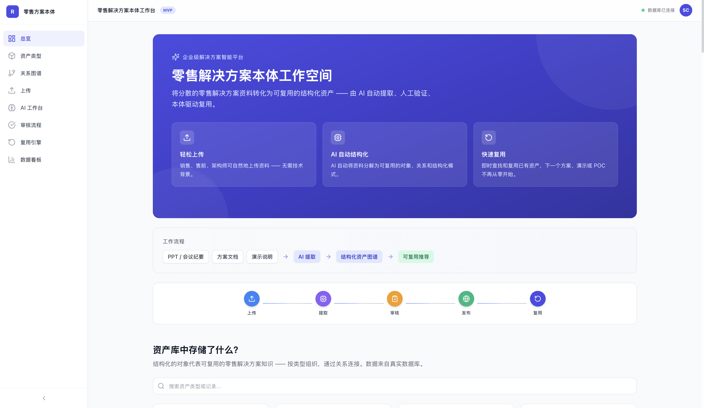
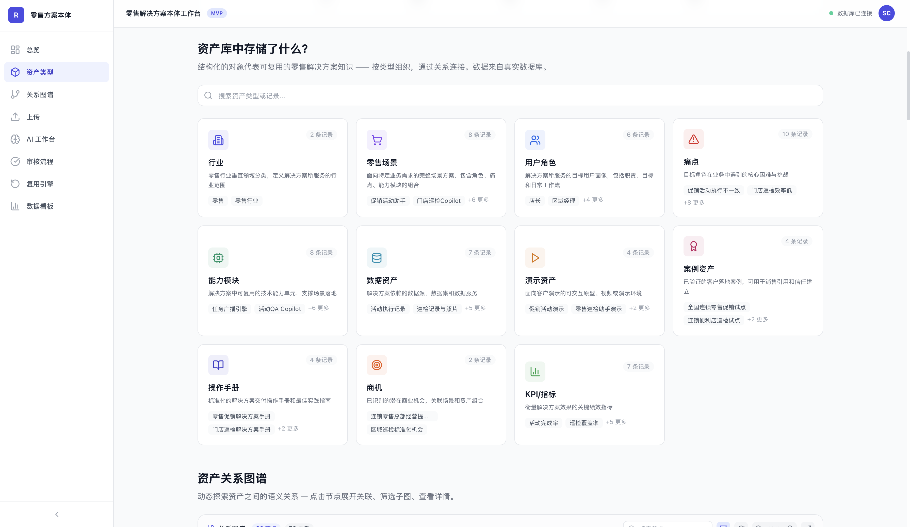
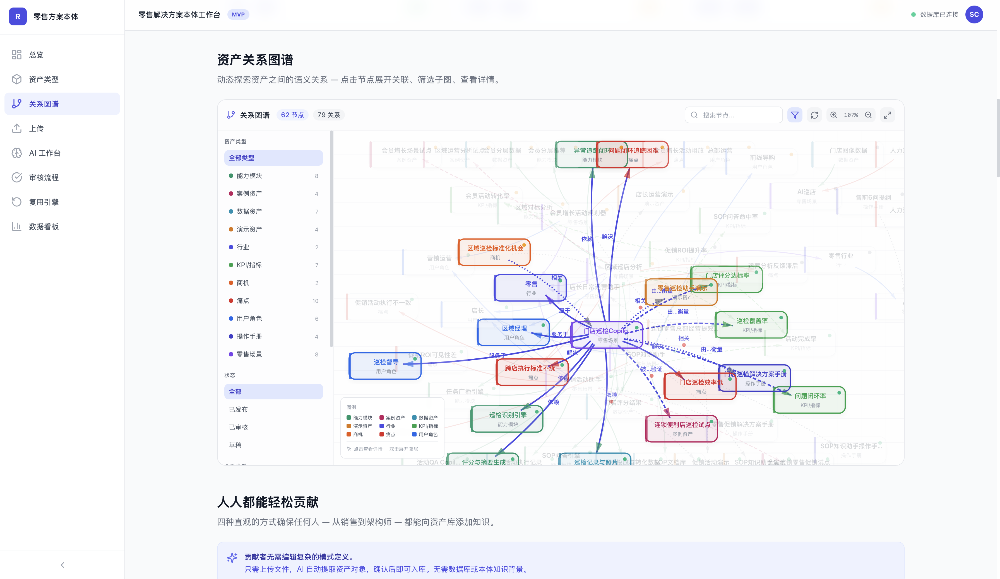
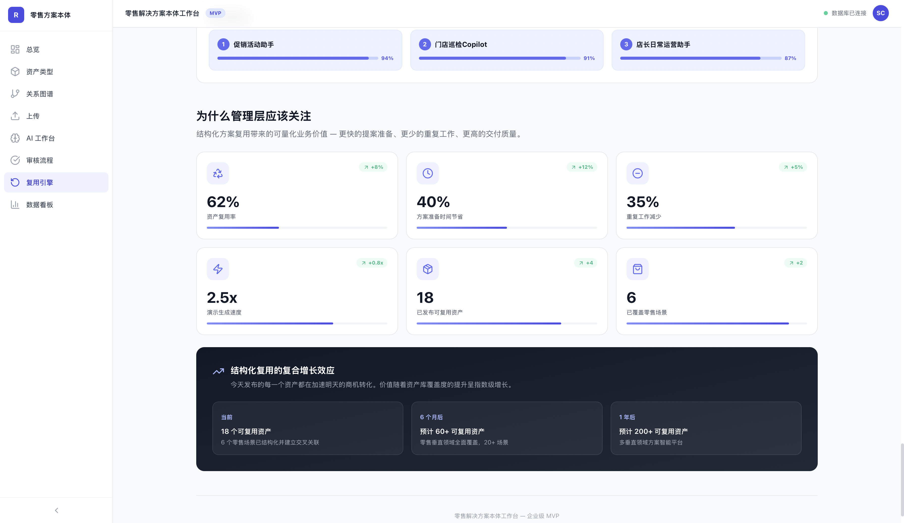

# 可视化界面预览与核心功能

本项目以“本体（Ontology）”为核心，聚焦零售知识资产的结构化、标准化与高效复用。以下为重点业务场景截图：

| 首页/总览 | 资产类型 | 关系图谱 | 数据看板 |
|:---:|:---:|:---:|:---:|
| [](static/screenshots/screenshot1.png) | [](static/screenshots/screenshot2.png) | [](static/screenshots/screenshot3.png) | [](static/screenshots/screenshot10.png) |

1. **首页/总览**：本体工作空间入口，聚合AI结构化、资产上传、复用等能力。
2. **资产类型**：本体驱动的多维资产分类，支持行业、场景、角色、能力等结构化管理。
3. **关系图谱**：以本体为基础，动态可视化资产间的语义关系，助力知识发现与复用。
4. **数据看板**：实时统计资产复用、结构化进展等核心指标，量化本体驱动的业务价值。

> 所有功能均围绕“本体”理念，助力零售知识资产的沉淀、治理与高效复用。

# 零售解决方案本体工作台

本项目包含前端 `Vite + React` 和后端 `FastAPI`，同时支持本地开发和 Docker 运行。

## 目录说明

- `src/`：前端源码
- `index.html`：前端入口
- `main.py`：后端 FastAPI 应用
- `requirements.txt`：后端 Python 依赖
- `package.json`：前端 npm 依赖
- `Dockerfile`：项目镜像构建脚本
- `docker-compose.yml`：可选的本地一键启动配置

## 快速启动（本地开发）

### 1. 准备后端环境

1. 安装 Python 3.11 或更高版本
2. 安装 MySQL（或使用本地已有 MySQL）
3. 创建本地数据库：

```sql
CREATE DATABASE ontology CHARACTER SET utf8mb4 COLLATE utf8mb4_unicode_ci;
```

如果你希望使用 MySQL 建库，也可以先执行 `db/schema.sql` 来创建表结构，执行 `db/seed.sql` 来插入示例数据。

4. 复制并填写本地配置：

```bash
cp .env.example .env
```

如果你不想使用 MySQL，也可以直接使用 SQLite 本地文件，后端会自动创建 `./ontology.db`。

5. 安装 Python 依赖：

```bash
pip install -r requirements.txt
```

### 2. 启动后端服务

```bash
uvicorn main:app --reload --host 0.0.0.0 --port 8000
```

后端启动后，接口 API 可通过 `http://localhost:8000/api/...` 访问。

### 3. 安装前端依赖并启动

```bash
npm install
npm run dev -- --host 0.0.0.0
```

前端开发服务器默认地址：

- `http://localhost:5173/static/`

## 一键启动（Docker + Docker Compose）

如果你希望直接复用，推荐使用 `docker-compose`：

```bash
docker compose up --build
```

启动后：

- 后端服务：`http://localhost:8000`
- 前端预览：`http://localhost:8000/static/index.html`

## 运行说明

- 前端通过 `vite.config.ts` 的代理配置，将 `/api` 请求转发到 `http://localhost:8000`
- 后端在首次启动时会自动创建缺失表结构
- 如果需要重建数据库，可先删除本地数据库，然后重新创建
